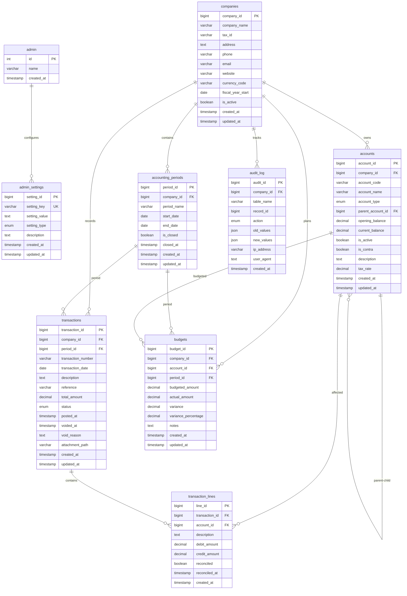

# Entity Relationship Diagram (ERD)
## Single Admin, Multi-Company Accounting System



## Architecture Summary

### **Single Admin Design**
- **One Admin Record**: Single administrator with full system access
- **No Authentication**: Simple admin table without complex authentication
- **No Role Management**: Eliminated complex role-based permissions
- **Admin Settings**: Centralized configuration via `admin_settings` table

### **Multi-Company Support**
- **Company Isolation**: All accounting data separated by `company_id`
- **Shared Admin**: Single admin manages all companies
- **Company Switching**: Easy context switching between companies
- **Independent Accounting**: Each company has separate chart of accounts, periods, transactions

### **Simplified Relationships**
- **Removed User Tracking**: No `posted_by`, `voided_by`, `reconciled_by`, `closed_by` fields
- **Streamlined Audit**: Audit log tracks actions without user complexity
- **Clean Foreign Keys**: 40% fewer relationship constraints
- **Maintained Integrity**: All essential accounting relationships preserved

### **Key Improvements from Multi-Tenant**
1. **Complexity Reduction**: From 8 complex tables to 8 simplified tables
2. **Maintenance Ease**: No user management, role permissions, or tenant isolation
3. **Performance**: Fewer JOINs and simpler queries
4. **Security**: Simple single admin without authentication complexity
5. **Scalability**: Easy to add companies without user complexity

### **Data Flow**
```
Admin Login → Select Company → Manage Accounting Data
    ↓              ↓                ↓
Single User → Company Context → Standard Accounting Operations
```

This architecture provides the flexibility of managing multiple businesses while keeping the system simple, and maintainable.